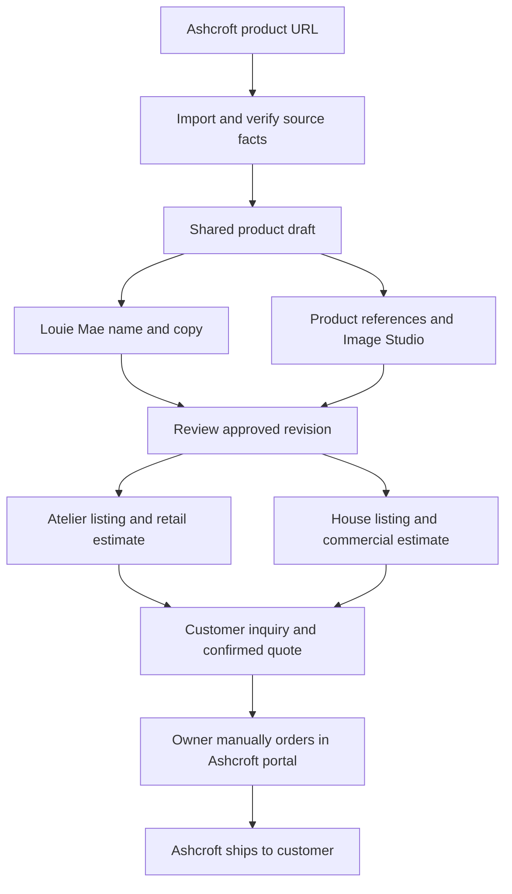

# Louie Mae × House of Louie Mae — Ashcroft catalog and admin build specification

Version: 1.0 · September 21, 2026  
Status: implementation specification; no implementation or production deployment is implied.  
Build entry point: [Master build specification and coverage checklist](louiemae-commerce-master-build-spec.md). Expanded scope: [House commercial three-provider workflow](house-commercial-three-provider-workflow.md) adds CJ dual publication, House-only owner-managed imports, and commercial Stripe invoicing/payment-to-fulfillment. Ashcroft supplier ordering remains manual.
Owner: Louie Mae. Supplier: Ashcroft Imports / Ashcroft Furniture.  
This document supersedes the earlier workflow recommendation wherever the two differ, especially supplier ordering: **the owner manually places every Ashcroft order through the Ashcroft dealer portal.**

## 1. Product objective and confirmed business rules

Build one product preparation workflow with shared records editable from Louie Mae Atelier admin and House of Louie Mae admin. New Ashcroft imports start in Louie Mae Atelier admin. An operator imports an Ashcroft URL once, prepares a Louie Mae name, description, accurate branded imagery, and two independent customer price estimates, then publishes to either or both destinations. House associates the existing product through Add from shared library.

Louie Mae handles merchandising, customer inquiries, quotes and internal order tracking. The owner manually places the supplier order in the Ashcroft dealer portal. Ashcroft ships the selected products directly to the customer's address. The website must not purchase from Ashcroft, log into its dealer account, or submit orders automatically.

### Confirmed requirements

- One imported supplier product identity shared by both channels.
- Generated, editable Louie Mae product name and product description.
- Product reference images and a built-in workflow to create Louie Mae backgrounds/environments while preserving the actual item.
- Approximately 3–4 useful product images, with more or fewer when actual source coverage warrants it; no forced fixed gallery count.
- Independent estimated retail and commercial prices.
- Optional publication to the Louie Mae customer storefront, House's customer landing-page catalog, or both.
- Ashcroft is the supplier and physical fulfillment provider.
- Manual owner ordering through the Ashcroft dealer portal.
- No CJ sourcing, CJ fees, CJ shipping estimates, CJ purchasing, or CJ fulfillment for Ashcroft items.
- Shared product updates must not require re-importing or regenerating the same content separately for each destination.

### Proposed first-release defaults

These are explicit design defaults, not claims that the owner has selected financial terms:

- Both customer channels treat Ashcroft prices as estimates and use an inquiry/quote action. An estimate is not a checkout charge. Existing non-Ashcroft checkout remains as-is.
- No automatic publication after import or AI generation.
- One approved name and description shared by default; optional channel-specific introductory copy and gallery ordering.
- Retail and commercial pricing policies remain unconfigured until entered by the owner. Do not invent a markup, margin, freight amount, discount or quote-validity period.
- Manual source refresh and dated manual dealer-cost/stock confirmation are supported at launch. A supplier feed is optional future scope.
- Use the existing authorized admin accounts for both interfaces. Do not create a separate Ashcroft login inside Louie Mae.
- Single-product URL import first; batch import and automated inventory feeds are later additions.

## 2. Scope and exclusions

### First release

Shared catalog, supplier-specific import adapter, source verification, AI naming/copy, Image Studio, separate pricing, per-channel publication, retail/House inquiry records, approved quote/order handoff, and manual supplier-order tracking.

### Excluded from this build

- Automated dealer checkout, purchase orders sent to Ashcroft, dealer credential storage, or supplier payments.
- CJ handling of any Ashcroft product.
- Warehouse operations, pick/pack flows, local on-hand inventory or fulfillment labels for Ashcroft products.
- A full accounting system. Commercial itemized Stripe invoices and verified payment handling are included through the three-provider specification; automatic Ashcroft supplier purchasing remains excluded.
- An assumption that Ashcroft provides a feed, order API, stock reservation, commercial warranty, or permission to use reference photography.
- Custom image-model training, Jev, multi-provider image routing, and batch generation across the whole supplier catalog.
- A wholesale migration of all existing CJ and manually entered furniture records to the new model.

## 3. Current implementation baseline

The following findings come from the local workspace review. They must be rechecked against the implementation branch before editing because related work is uncommitted.

| Area | Existing foundation | Required change |
|---|---|---|
| Atelier | `components/AdminPage.tsx`, `components/ProductStudio.tsx`, `convex/products.ts`, `products` table | Add supplier-aware import and linked shared-product editing; remove Ashcroft dependence on CJ status |
| House | `furniture/Admin.tsx`, `furniture/Catalog.tsx`, `convex/furniture.ts`, `furnitureProducts` and `furnitureQuotes` | Add shared catalog linking, commercial price policy, shared editor and inquiry-to-order handoff |
| Import | `convex/furnitureImport.ts`, `convex/scraper.ts` | Dedicated Ashcroft parsing and normalized supplier identity; preserve existing SSRF protection |
| AI copy | `convex/smartNames.ts`, `convex/smartDescriptions.ts`, `convex/brandVoice.ts`, existing source snapshots | Reuse brand rules and evidence handling; adapt supplier snapshot without coupling to sourcing |
| Images | Existing image uploads, storage helpers, gallery components, approved brand assets | Add background generation, reference/output separation, review, durable jobs and approved media revisions |
| House estimates | `lib/furniture.ts`: high estimate = cost × USD rate × 6; low = high − $100 | Introduce explicit Ashcroft retail/commercial policies; preserve other suppliers' behavior until separately migrated |
| Authorization | Convex Auth and admin allowlist; some helpers have CJ-specific names | Reuse authorization semantics; separate general admin permission from supplier-routing logic |
| Production route | `/furniture/admin` displayed the prelaunch page during the previous browser inspection | Verify deployment/rewrite behavior before release; keep public prelaunch configuration intentional |

Do not publish unrelated in-progress changes as part of this feature. No secret values belong in this spec, client bundles, logs or fixtures.

## 4. Shared product architecture

### 4.1 One canonical product, two channel listings

Introduce a shared canonical catalog for Ashcroft. Existing `products` and `furnitureProducts` may remain as compatibility records for the current storefronts, but each linked record must reference the same canonical product ID. They are generated channel views, not independent supplier records.

### 4.2 Shared versus channel-owned fields

| Shared product fields | Channel-owned fields | Never public |
|---|---|---|
| Supplier identity, SKU/variants, product facts, source snapshots, approved name and core copy, approved media | Publication state, category/collection placement, featured position, gallery selection/order, optional intro, pricing policy/result, CTA | Dealer cost, cost evidence, supplier notes, internal margins, AI prompts/jobs/costs, rights evidence, customer personal information |

Editing shared content in either admin updates the shared draft. The UI must say that the content is shared and show the destinations affected. Editing a channel price or intro must not alter the other channel.

Saving a draft never silently changes a live listing. Publication attaches a specific approved product revision and a channel pricing revision. If only one channel is updated, show that the other uses an older revision. “Publish to both” attaches the same shared revision to both channels atomically.

### 4.3 Identity and deduplication

- Canonical product identity uses supplier product ID when reliably available; variants use verified supplier SKU/variant IDs.
- Store normalized product URL aliases. Strip tracking parameters and normalize collection-prefixed paths without merging distinct products.
- Before a SKU is known, a normalized URL identifies a provisional draft. After verification, reconcile with existing supplier identities.
- Re-importing the same SKU in Atelier or adding it from House's shared library must resolve to the existing shared record.
- Handle concurrent imports transactionally: one canonical identity, not two records with the same SKU.
- Return “Already in your library” with Open product, Review source updates, and Add to other destination actions.
- Left/right-facing or color variants remain distinct. Group separate supplier listings only after explicit review, never because their names look similar.
- Archive records rather than hard-deleting products referenced by quotes or orders.

## 5. Admin information architecture

### 5.1 Louie Mae Atelier admin

Add a supplier selector to Add product: existing sources plus **Ashcroft**. Recognized Ashcroft URLs may preselect the supplier, but the backend independently verifies the host.

Add filters to the product library: Supplier, Published destination, Draft/Needs review/Published, Missing images, Pricing needs review, Source availability. For each Ashcroft row show the Louie Mae name, thumbnail, supplier SKU, retail estimate, commercial estimate, destination badges and next required action.

Open the shared editor with these tabs:

1. **Source & details** — imported evidence and verification.
2. **Name & story** — generated names, description and specifications.
3. **Image Studio** — reference selection, environments, generation and approval.
4. **Pricing** — independent Retail and Commercial panels.
5. **Destinations** — channel settings, previews and publication.
6. **History** — imports, edits, generation, approvals, price changes and publications.

Persistent header: product name or “Untitled Ashcroft product,” SKU, saved/unsaved status, destination badges, and supplier banner: **“Fulfilled by Ashcroft · Ordered manually in dealer portal.”**

Footer actions: Save draft, Preview, Review & publish. Unsaved edits must not disappear when switching tabs or opening source links. Source links open in another tab.

### 5.2 House of Louie Mae admin

Keep `/furniture/admin` as House's admin destination. Offer:

- **Catalog:** House-associated products with commercial estimates and publication state.
- **Add from shared library:** search existing products by Louie Mae name, supplier name or SKU; select and configure the House listing without importing again.
- **Add an Ashcroft product:** select an existing shared product, or open the dedicated Atelier Ashcroft import workflow for a new URL. House does not create a separate duplicate Ashcroft import pipeline.
- **Quote requests:** project details, requested products/quantities and preserved estimates.
- **Ashcroft orders:** relevant manual dealer-order records; link to the same underlying order also visible in Atelier where authorized.

Replace the existing “publishing here does not add products to the original store” explanation with destination-specific instructions. Adding House as a destination is an association, not a duplicate product import.

House's commercial panel includes category, featured placement, commercial introductory text, requested quantity assumptions, estimate basis and CTA preview. Commercial placement does not imply commercial certification or warranty eligibility.

### 5.3 Consistent editing behavior

Both admins use the same shared editor and backend contracts. Channel defaults differ, but validations and supplier facts do not. Display a revision conflict if another admin saves meanwhile; offer reload/compare rather than silently overwriting.

Use explicit Save draft and unsaved-change navigation protection in v1. Save generation/job results server-side even when the editor closes. Reopening resumes the draft and job status.

## 6. Import workflow and source review

### 6.1 Input and extraction

Accept a supported Ashcroft product URL. Reject collection pages, unsupported hosts, malformed URLs and unsafe redirects with an actionable message. Reuse existing safe-fetch infrastructure, with response size/time limits and permitted CDN checks for reference assets.

Extraction priority:

1. Authorized structured supplier feed, if one is separately supplied and approved.
2. Reliable structured product data from the selected page.
3. Product-specific rendered/HTML sections: title, description, Features, Shipping Dimensions and gallery.
4. Operator-provided facts/images when extraction is incomplete.

No login automation, browser-cookie copying, CAPTCHA bypass, or scraping of private account data. A server import does not inherit the operator's dealer session. If dealer pricing is unavailable, ask for a dated manual cost entry in the draft instead of using $0 or a guessed number.

### 6.2 Required source fields

Capture where available: supplier title, product ID, variant IDs, SKU, canonical URL, fetched time, raw description, category, gallery, dimensions with labeled axes/units, material/finish/color, orientation, seat details, care, assembly, product weight, carton dimensions/weights, availability evidence and source price/currency/type.

A source price needs a classification: unverified page price, verified dealer cost, or manually confirmed cost. Do not assume a visible public price is dealer cost.

Extract only the selected product gallery. Exclude recommendation cards, logos, financing graphics, related-item prices and thumbnails duplicated at multiple resolutions. Preserve original image order and reference provenance; tag dimension diagrams separately from photographic views.

### 6.3 Evidence and conflicts

Display each important fact beside its source section and verification status: imported, confirmed, missing or conflicting. Keep raw source text private for review; never render supplier HTML as trusted customer content.

Conflicts involving identity, orientation, material, dimensions or price require resolution before publishing the affected claims. The operator records the corrected value, evidence/note, reviewer and time. Missing optional care or packaging fields do not block an otherwise accurate listing; omit unsupported claims.

The Lore test fixture must flag the right-facing title versus left-facing description. It must not silently select one because a language model seems confident.

### 6.4 Refresh behavior

“Refresh source” creates a new snapshot and a field-level diff. It never overwrites approved branding, media, manual overrides, price locks or order history.

- New cost or stock evidence prompts review according to the source's confidence and freshness.
- Cosmetic supplier-copy changes do not invalidate approved Louie Mae copy automatically.
- A changed SKU, material, dimensions or product geometry invalidates relevant draft approvals and flags live listings for review.
- Reliable out-of-stock information changes both channel availability displays; unknown/stale stock shows “Availability to be confirmed,” not “In stock.”
- A source refresh failure preserves the last known data with a visible error and last-verified timestamp.

## 7. Name, description and product facts

### 7.1 Naming

“Generate names” proposes three editable options using existing Louie Mae naming rules, the actual product category and brand references. Each suggestion must retain enough product identification for shoppers, such as a distinct name plus “Leather Sectional.”

Do not claim a different manufacturer, origin, material or exclusivity through naming. Supplier SKU/title remain searchable internally even after renaming. Check existing name claims across shared and legacy catalogs. The same canonical product may use its approved name on both channels without being treated as a duplicate-name collision.

Selecting a suggestion changes the draft only. Manual edits and regeneration must not erase the current approved name. Store generator/prompt version and selected result for traceability.

### 7.2 Description

Reuse Louie Mae's existing voice configuration: warm, specific, restrained, grounded in the item. Produce an editorial introduction plus structured details, with length determined by available evidence.

Keep measurements, orientation, assembly and material composition explicit. Never upgrade genuine leather to top-grain leather, a mixed frame to solid wood, or residential furniture to contract-grade without evidence. Commercial copy may describe a potential setting without promising suitability or certifications.

Core copy is shared by default. House may add a project-oriented introduction; Atelier may add a consumer introduction. Neither override may change physical facts. Specifications always render from approved structured fields, not separately generated numeric prose.

### 7.3 Review and regeneration

Show generated versus current text. Allow accept, edit, reject or regenerate. Generated content is a suggestion until accepted. Failed generation leaves imported facts and manual editing available. Changed verified facts mark dependent copy for review without deleting approved text.

## 8. Image Studio specification

### 8.1 Objective and controls

Create original Louie Mae environments/backgrounds around the actual product. The generation objective is styling the presentation, not redesigning the furniture.

Controls: selected product/variant, reference view, environment preset, optional scene note, output aspect ratio, generation quality, hero/gallery role and Generate action. Advanced technical options stay collapsed; provider credentials never appear in the client.

### 8.2 Reference and brand libraries

Maintain separate libraries:

- **Product references:** exact supplier/owned photographs, SKU/variant linkage, angle tags, source URL/storage reference and permission status.
- **Brand references:** approved Louie Mae photographs and versioned aesthetic notes; used for setting, light and styling, not product geometry.
- **Generated candidates:** private review outputs and their generation metadata.
- **Approved listing media:** owned stored assets approved for customer display.

Initial style preset: warm ivory/plaster, natural textures, aged wood, muted earthy accents, soft daylight and minimal props. Curate actual existing Louie Mae assets before enabling production generation. Do not substitute this written brief for visual reference selection.

Use separate fields for reference-use permission and publication permission. The user has said original Ashcroft photos should not appear on the storefront; keep them reference-only unless explicitly changed later. If references cannot be used for editing, allow approved/owned image upload. A generated file does not automatically establish permission or product accuracy.

### 8.3 Product preservation

Prefer segmentation/compositing with a protected product region when supported: preserve original item pixels and generate its environment, adjusting grounding/shadows at boundaries. Reference-guided full rendering is an alternative candidate workflow, not a guarantee of exactness.

Protect shape, scale relationships, cushion count, arm/leg design, stitching, wood/leather finish, upholstery texture, hardware and orientation. Never mirror a sectional to simulate another variant. Props must not conceal identifying features or imply accessories are included. Maintain realistic floor contact and room scale.

A prompt to preserve the item is not sufficient validation. Compare candidates to references before publication. If the selected service cannot preserve the product reliably, retain the review gate and use licensed compositing/owned photography rather than relax accuracy requirements.

### 8.4 Generation sequence

1. Review available source angles and choose a hero reference.
2. Select the Louie Mae preset and generate one hero candidate.
3. Approve the environment and product fidelity or request a specific correction.
4. Generate remaining useful angles from corresponding real references, reusing the approved environment reference and consistent settings.
5. Review each candidate independently; regenerate only failed images.
6. Approve the gallery, choose cover and ordering, and generate web derivatives.

Default shot roles: full-item editorial hero, front/three-quarter, alternate supported angle, and a useful detail. Minimum publishable coverage is one approved full-item image plus operator acknowledgement that coverage is sufficient; normally target 3–4. Missing crucial functional/variant details must be resolved with additional references, not fabricated.

All views should feel like the same shoot, while acknowledging that generation does not guarantee perfect scene consistency. If an authentic rear view is unavailable, omit it or request one. A detail crop must come from sufficiently resolved reference detail rather than invented texture.

### 8.5 Review UI and statuses

Show source/output side by side with zoom. Review controls: Approve, Reject, Regenerate with note, Set cover, Reorder, Assign variant and Exclude from destination.

Image states: reference → queued → generating → needs review → approved or rejected; failed/canceled are separate job outcomes. A new candidate never replaces a published approved image automatically. Approval records reviewer/time and exact asset revision.

Quality checklist: correct SKU/variant; all required product features preserved; actual finish/color; plausible proportions; no invented accessories, logos, text or watermarks added by the prompt; clean edges/shadows; whole-item visibility; sufficient resolution; correct aspect ratio. Provider authenticity metadata must not be stripped merely to conceal AI generation.

### 8.6 Provider and cost controls

First provider: Gemini image API through server-side actions, reusing the project's Google SDK foundation. Model IDs, supported operations, SDK compatibility, limits and prices must be verified when implementing. No model identifier or per-image cost is fixed by this spec.

Run a representative pilot to select hero/gallery defaults by accuracy and cost per accepted gallery. Jev and custom model training are outside v1.

Use durable background jobs, per-product spend limits, configured retry limits and actual/estimated usage records. Before generating, display the number of requested candidates and an estimate when known; never present a fabricated exact cost. Prevent duplicate clicks using request keys. Do not regenerate both-channel media separately.

## 9. Separate pricing specification

### 9.1 Inputs and ownership

Pricing is server-calculated and independently configurable for Retail and Commercial. Every variant has its own supplier-cost evidence. All money is stored in integer minor units with currency; USD is the initial supported customer currency.

Inputs: verified or explicitly provisional dealer unit cost, supplier discount if confirmed, quantity, known per-item handling, estimated/confirmed freight, project charges, target pricing policy, manual override, rounding rule, applicable verified advertised-price floor, and last reviewed timestamp.

Do not use CJ costs or the existing 6× House rule for Ashcroft. Do not assume a commercial discount. Different customer channels may use different policies even when their supplier cost is identical.

### 9.2 Estimate basis

Support explicit bases:

- **Merchandise only:** displayed unit estimate excludes delivery and tax; exclusions must appear beside the customer estimate.
- **Merchandise with estimated delivery:** includes a documented delivery assumption; explain that final delivery depends on location/service.
- **Project estimate:** line quantities plus separate shared delivery/handling/project charges; never multiply a one-time project fee by every unit.

Unknown freight remains unknown. It is not represented as confirmed zero. Packaging data alone cannot establish freight price.

### 9.3 Policy methods

Support one chosen method per channel policy:

- Markup: selling estimate = configured cost basis × (1 + markup rate).
- Gross margin: selling estimate = configured cost basis ÷ (1 − margin rate), with 0 ≤ margin < 1.
- Manual customer estimate: operator enters a point or ordered low/high range with a reason.

Use descriptive labels so markup and margin cannot be confused. Apply the configured rounding rule to customer output. Low/high ranges must come from explicit low/high assumptions or manual values, not an arbitrary $100 spread. Confirmed minimum-price constraints apply after rounding.

Illustrative test only: a $1,000 merchandise cost with 50% markup yields $1,500; a 40% gross margin yields approximately $1,666.67 before configured rounding. These are test parameters, not proposed business rates.

### 9.4 Admin pricing panels

Each channel panel shows source cost/verification, cost basis, selected policy, editable inputs, calculated unit estimate/range, quantities where relevant, included/excluded charges, calculated merchandise margin, last review, override status and exact customer preview.

Use separate “Lock customer estimate” controls. New source costs recalculate suggestions but never silently replace locked/published prices. Flag stale costs or margin below configured limits. Require an explicit publish action for price changes. An unconfigured policy allows saving a draft, but blocks showing a numeric customer estimate.

Commercial quantity tiers are optional and owner-defined. Record whether they are Louie Mae pricing decisions or supported by confirmed supplier discounts; do not imply supplier tier discounts exist.

### 9.5 Customer display and quote snapshots

Atelier example: “Estimated merchandise price: $X” or “$X–$Y”; “Delivery and tax quoted separately” where applicable; CTA “Request availability & final price.”

House example: “Estimated merchandise: $X–$Y per unit”; quantity selector; merchandise subtotal with separately labeled charges; CTA “Request a project quote.”

Do not show a crossed-out MSRP, free shipping, guaranteed delivery date or retail-versus-commercial savings without verified inputs. Quotes capture immutable product, variant, quantity, price-policy revision, assumptions, exclusions and timestamp. Later catalog edits do not change submitted quote snapshots.

## 10. Destinations, publication and customer behavior

### 10.1 Destination controls

Destinations tab has independent Louie Mae and House cards. Each card includes Enabled, category/collection, selected approved images/order, channel introduction, price preview, status and Preview destination. Adding a destination defaults to draft.

Distinguish “Associate with House” from “Publish on House.” An associated draft is visible to staff but absent from the customer landing page.

### 10.2 Publication gates

Server validates identity, resolved material product conflicts, approved name/copy, factual structured details, approved full-item media with usable derivatives, valid selected-channel pricing or explicit price-on-request mode, correct supplier route, and valid category/destination mapping.

For numeric estimates based on provisional cost, the owner must explicitly review the provisional basis; the customer still sees an estimate. Supplier availability may be unknown if the CTA requires confirmation and no stock guarantee is shown.

“Publish to both” is a single Convex transaction after asynchronous preparation is complete. Either both channel references advance, or neither does. Validate all selected channels before mutating. Publication retries use a request key and expected draft revision.

Publishing does not launch marketing email or place any supplier order. Hiding one channel preserves the other channel and shared product. Archiving a shared product hides both, preserves history and requires explicit admin action.

### 10.3 Customer-facing inventory meaning

This catalog represents supplier-fulfilled availability, not Louie Mae warehouse stock. Do not create two inventories when one product is published twice. A customer inquiry does not reserve supplier stock. Reconfirm price, stock and delivery before a final customer commitment and again before manually ordering where needed.

Ashcroft estimates must not enter the existing retail automatic checkout as final payable totals. In retail mixed selections, keep existing CJ checkout behavior and direct Ashcroft lines into a clearly labeled quote flow in v1. House commercial projects may combine providers in a confirmed Stripe invoice under the three-provider specification. A future mixed-provider self-service retail checkout remains separate scope.

## 11. Customer inquiry to manual dealer order

### 11.1 Inquiry and quote flow

1. Customer submits the appropriate retail or commercial inquiry.
2. Backend validates publication, variant, quantities and estimate revision; saves an immutable request with channel origin.
3. Reuse the existing approved notification mechanism where applicable, with idempotency and retry status. New retail requests need equivalent validation; do not expose commercial customer details across public views.
4. Operator checks current stock, dealer cost, freight, delivery method and customer requirements through the dealer portal or existing supplier contact process.
5. For House projects, the operator prepares the final version in the commercial quote editor and sends a finalized Stripe invoice after customer acceptance, as defined in the three-provider specification. Retail-only quote handling may retain the existing manual process. Record amount, exclusions, validity and references.
6. Record customer acceptance and payment evidence. Verified commercial invoice payment automatically records financial readiness; an externally paid retail quote uses a separate authorized manual confirmation with evidence. Saving a status or customer acceptance alone is not payment proof.
7. Verified commercial payment creates one “Needs dealer order” task for its approved Ashcroft lines, subject to the project's release/coordination rules. The manual retail flow creates the task explicitly after readiness. Neither path purchases from Ashcroft; the owner places that order in the dealer portal. An inquiry alone never creates a purchase task.

### 11.2 Dealer-order task

Display the customer-facing name alongside the exact Ashcroft SKU/variant, quantity, current dealer cost, confirmed delivery charge/method, customer shipping/contact details, special instructions, source link and quote/order references. Show the data verification time and whether changes require customer reconfirmation.

Actions:

- Open Ashcroft product/dealer portal in another tab.
- Copy selected order details on an explicit click.
- Mark “Ordered with Ashcroft,” recording supplier order/reference number, submission date, ordered quantities and actual supplier totals when available.
- Add shipment/carrier/tracking and shipped quantities.
- Record delivery, issue, cancellation or completion.

Opening or copying data never changes fulfillment status. Only the operator's explicit recorded action does. Do not store dealer credentials or use a background process to fill/pay/submit an order.

### 11.3 State model

Keep inquiry, customer financial state and supplier fulfillment state separate.

| Entity | States | Transition rule |
|---|---|---|
| Inquiry/quote | new, reviewing, quoted, accepted, declined, expired, closed | Operator actions; acceptance requires recorded evidence; no automatic financial commitment |
| Financial readiness | unverified, awaiting payment/authorization, ready, refund review | Verified commercial Stripe payment, or separately authorized external-payment confirmation with provenance; never inferred from a quote |
| Supplier-order task | needs dealer order, on hold, ordered with Ashcroft, partially shipped, shipped, partially delivered, delivered, canceled | Ordered requires supplier reference; shipments track quantities; canceled requires confirmed outcome |
| Issue | open, awaiting supplier/customer, resolved | Separate overlay so a damage case does not erase shipment history |

Simple list views may summarize Needs dealer order → Ordered with Ashcroft → Shipped → Delivered. Detailed records must support partial shipments and issues. No timer automatically changes these states.

### 11.4 Duplicate prevention and exceptions

- Create at most one active task per approved line allocation unless the owner deliberately splits quantities. Transactionally enforce allocation limits.
- Display “In progress by [admin]” while another operator is preparing the same dealer order. Before recording a submission, refresh task status. Warn about duplicate supplier references and show related orders.
- The system cannot guarantee prevention of duplicate purchases made externally; reconcile unclear portal outcomes before placing another order.
- One supplier order may include several task lines; one customer order may have multiple supplier orders/shipments. Track allocations and totals by line.
- If cost, stock or delivery changes, place task on hold and reconfirm with the customer as needed.
- Cancellation recorded in Louie Mae does not cancel Ashcroft's order. Require a supplier cancellation confirmation before marking it canceled; refunds remain a separate business/payment process.
- Damage/returns: log issue, evidence references and resolution; manual handling with Ashcroft, not CJ.
- Customer tracking notifications occur only through an explicitly designed send action or existing approved notification policy. Recording a tracking number alone must not introduce surprise emails.

## 12. Logical backend data model

Names below are proposed. Reuse compatible existing tables rather than duplicate source-snapshot, naming or usage systems.

| Entity | Core fields and relationships |
|---|---|
| Shared catalog product | ID, supplier ID, supplier product ID, canonical URL/aliases, lifecycle state, current draft revision, approved revisions, timestamps |
| Supplier variant | Shared product ID, supplier SKU/variant ID, option values, orientation, fact references, cost/stock evidence |
| Source snapshot | Product/variant identity, schema/parser version, fetched time, content hash, structured evidence, private raw content, warnings/conflicts |
| Product revision | Immutable approved name/core copy/facts/media selections, source snapshot references, reviewer/time; mutable draft kept separate |
| Channel listing | Product ID, channel, legacy record ID if used, draft settings, published product revision, published pricing revision, status, category/intro/gallery overrides |
| Cost evidence | Variant, cost/currency/type, verified by/at, source reference and expiry/review metadata |
| Pricing policy/revision | Channel, method, assumptions, quantity tiers, rounding, override/lock, calculated results, reviewer/time |
| Media asset | Storage ID, product/variant, role, source/generation parent IDs, dimensions, content hash, visibility, permission evidence, approval and derivatives |
| Brand preset | Version, selected reference assets, visual brief, allowed scene settings, approval metadata |
| AI job | Product/draft revision, operation, input hash, request key, provider/model/prompt/preset versions, state, lease/attempts, usage, result IDs, error code |
| Customer request/quote | Origin channel, customer data, immutable item/price snapshots, status, acceptance/external quote references |
| Manual supplier order/task | Supplier/provider, customer order/quote reference, allocated lines, state, operator notes, portal-order references, actual costs, timestamps |
| Shipment | Supplier order, line quantities, carrier/tracking, shipped/delivered evidence and timestamps |
| Audit event | Actor, action, entity/revision, before/after summary, time, correlation ID; sensitive values redacted where appropriate |

Indexes: supplier identity; product by channel; SKU; normalized source URL; jobs by state/next run; requests by channel/state; tasks by supplier/state; shipments by supplier order; audit by entity/time. Convex application-level transactional checks must enforce identities where indexes alone are not unique constraints.

Legacy products continue to use their existing IDs. Linked Ashcroft records must never permit parallel edits to duplicated shared facts. Public queries use explicit safe projections; filtering a few private fields out of a whole database document is insufficient.

## 13. Proposed backend contracts

All admin operations authenticate and enforce authorization server-side. Suggested module/function names describe responsibility, not mandatory naming.

| Operation | Input | Required behavior |
|---|---|---|
| `importAshcroftUrl` | URL, request key, intended channel | Safe fetch; dedupe; snapshot + saved draft; warnings; no publication/CJ |
| `refreshAshcroftSource` | Product ID, expected revision | New snapshot/diff; preserve approved content |
| `saveSharedDraft` | Product ID, expected revision, validated patch | Optimistic concurrency; audit; invalidate only affected approvals |
| `generateNames` / `generateDescription` | Product ID, draft revision, request key | Use evidence and brand version; persist suggestions, not live changes |
| `queueImageGeneration` | Variant/reference/preset/shot, draft revision, request key | Validate permission and budget; durable job; no synchronous page dependency |
| `reviewMedia` | Asset ID, approve/reject, review note | Validate lineage/variant; audit; no automatic publish |
| `calculateChannelEstimate` | Variant, channel, quantity, policy draft | Server calculation with breakdown and missing-input warnings |
| `saveChannelDraft` | Product/channel, expected revision, settings | Changes one channel only |
| `publishDestinations` | Product revision, selected channel revisions, request key | Validate all; atomic publication; no supplier/marketing side effects |
| `unpublishDestination` | Product/channel, expected revision | Hide selected channel; preserve snapshots/history |
| `publicCatalog` / `publicProduct` | Channel and public filters/slug | Published approved projection only, no private costs or source references |
| `submitInquiry` | Channel, listing/variant IDs, quantities, customer fields, request token | Server revalidation, rate limits, snapshots, idempotent persistence |
| `createManualOrderTask` | Accepted quote/order lines, readiness evidence, request key | Allocate once; no portal action |
| `recordSupplierOrder` | Task allocations, supplier reference, date, actual totals | Validate allocations/state; audit manual confirmation |
| `recordShipment` / `recordDelivery` | Supplier order, quantities, tracking/evidence | Prevent over-shipping/delivery; preserve partial states |

Use stable error codes with plain messages: unsupported URL, source unavailable, dealer cost needed, duplicate product, conflicting facts, stale draft, generation unavailable, budget reached, approval required, incomplete pricing, destination not ready and duplicate allocation. Do not surface provider secrets or raw internal stack traces.

## 14. Durable processing and operational safeguards

AI/fetch work runs in actions/workers; transactional state changes occur in mutations. Job states: queued, running, retry scheduled, needs review, succeeded, failed, canceled. Leases prevent concurrent processing and expired leases permit recovery.

Idempotency keys cover import, generation, publication and inquiry/task creation. A provider timeout after submission is an uncertain outcome: reconcile with provider request/status support if available; otherwise mark unknown outcome and require an explicit retry decision. Do not promise exactly-once third-party billing where the provider does not support it.

Result persistence checks draft/reference version. A late result for an older draft remains accessible as an older candidate, never replaces newer approved work. Cancellation prevents adoption of results even if an external request cannot be stopped.

Track import success, missing-field rates, image approval rate, accepted-gallery cost, duplicate calls prevented, job failures, publication errors and manual-order aging. Do not send customer PII to image/copy providers; generation needs product data only.

Reference images and raw source data remain admin-only in application access. Select storage/delivery controls that genuinely restrict reference assets; an unlisted public blob URL is not an access-control mechanism. Approved customer assets use stable owned URLs and optimized responsive derivatives. Reject invalid image types, oversized inputs and unexpected download hosts.

## 15. Permissions and security

Use existing authorized admins initially. Structure authorization so future roles can separate catalog editing, image approval, pricing/publication and customer/order access without rewriting endpoints.

Require authorization for every cost/source/job/private-media/order query and mutation, regardless of which admin called it. Validate all numeric inputs and enums server-side. Public inquiry creation has rate limits, abuse controls, bounded payloads and idempotency; it does not expose another customer's request through a predictable ID.

AI output and scraped content are untrusted data. Validate schema and supported claims, sanitize text, and never execute embedded supplier instructions. API keys stay server-side. Log provider errors in a redacted form. No Ashcroft cookies, passwords or dealer payment details are stored.

## 16. Failure, empty and recovery states

| Condition | Required operator experience |
|---|---|
| URL cannot be read | Explain fetch failure; retain URL; retry or enter facts manually |
| Account-only cost absent | Show “Dealer cost needed”; permit draft/image work; no invented numeric estimate |
| Only some facts extracted | Open partial draft and highlight omissions; do not fail all usable content |
| Wrong/related images detected | Exclude from product gallery; allow manual removal/upload |
| AI unavailable or budget exhausted | Preserve draft; allow manual name/copy/media work; no publication side effects |
| Image fails review | Keep other approved images; retry selected shot only |
| Admin closes browser | Saved draft/jobs persist and reopen with current status |
| Concurrent edit | Show revision conflict and comparison; do not overwrite silently |
| One selected destination invalid | Block publish-to-both atomically; explain which destination needs attention |
| New stock/cost information | Show update review; retain quote/order snapshots |
| Order outcome uncertain in dealer portal | Place internal task on hold for manual reconciliation; do not submit again automatically |
| Supplier ships in parts | Show quantities remaining and multiple shipments without marking whole order delivered |

## 17. Migration and rollout

1. Recheck workspace/branch state and preserve unrelated uncommitted work. Establish fixtures for legacy CJ and House behavior.
2. Add optional schema fields/new tables and supplier/provider guards without changing existing product visibility or pricing.
3. Implement canonical Ashcroft import/draft and shared library association. Do not auto-link legacy products by name; offer SKU-based reviewed linking.
4. Add naming/copy and separate price policies; remove Ashcroft from every generic CJ scheduling/eligibility path, including bulk import, retry and background jobs.
5. Add Image Studio, storage visibility, durable jobs and approval.
6. Add per-channel previews/publication and quote-only Ashcroft customer actions.
7. Add manual supplier-order tracking and partial-shipment handling.
8. Verify backend deployment, `/admin`, `/furniture/admin`, public `/furniture`, shared links, existing prelaunch behavior and unauthorized access on preview.
9. Pilot Lore as a draft with orientation conflict unresolved until evidence is supplied. Then use a small varied batch with alternate materials/variants.
10. Release after acceptance checks. Gate new Ashcroft features so they can be disabled without deleting data or affecting existing CJ products. Backend must reject operations when disabled; hiding UI alone is insufficient.

Rollback hides the new Ashcroft destinations/features while retaining drafts, references, quotes and manual-order records. Restore prior publication revisions if needed. Never roll back by deleting order history or reopening completed supplier tasks.

## 18. Acceptance criteria and test matrix

| ID | Scenario | Pass condition |
|---|---|---|
| A01 | Import supported Ashcroft URL in Atelier | One saved hidden shared draft; correct supplier/provider; no CJ work |
| A02 | Add existing Ashcroft SKU from House or re-import a collection-prefixed URL in Atelier | Existing shared product opens; no second canonical record |
| A03 | Two simultaneous imports | Transactional dedupe produces one identity |
| A04 | Similar left/right or color listings | Distinct verified variants/products; no accidental merging |
| A05 | Lore contradictory orientation | Visible blocking conflict for orientation; no silent AI resolution |
| A06 | Dealer cost unavailable | Draft usable; cost unknown; no fabricated price |
| A07 | Gallery has recommendations and duplicate sizes | Only selected-product references retained; thumbnails deduplicated |
| A08 | Generate/select name | Brand-appropriate editable options; namespace validation; same product allowed across channels |
| A09 | Description with mixed frame/genuine leather evidence | No unsupported solid-wood/top-grain/commercial-grade claims |
| A10 | Image generation on selected variant | Reference lineage preserved; candidate private until approved |
| A11 | Wrong cushion/orientation/material in image | Rejectable; publication cannot select rejected/unapproved candidate |
| A12 | Generation double-click/timeout/reopen | Duplicate submission prevented where possible; uncertain outcomes explicit; result survives browser close |
| A13 | Old job finishes after new edit | Old candidate retained separately; no overwrite of current approval |
| A14 | Retail/commercial methods differ | Independent server results; no 6× or CJ pricing leakage |
| A15 | Unknown freight/one-time project fee | Clearly excluded/estimated freight; project fee counted once |
| A16 | Markup versus margin boundary values | Correct formulas/rounding; invalid margin rejected; zero versus unknown distinguished |
| A17 | Source cost changes after price lock | Suggested update shown; live estimate unchanged until review/publication |
| A18 | Publish both | Same approved product revision on both; selected channel-specific pricing retained |
| A19 | One destination fails validation | Neither channel changes during publish-to-both |
| A20 | Unpublish House only | Atelier remains published; shared product and historical quotes remain |
| A21 | Draft/private data queried publicly | No hidden drafts, dealer costs, prompts, source notes or reference assets leaked |
| A22 | Source re-import after branding approval | New source snapshot/diff; approved name/copy/media preserved |
| A23 | Submit retail or commercial inquiry twice | One request per token; correct channel, quantities and immutable estimate snapshot |
| A24 | Catalog price changes after inquiry | Original request snapshot remains unchanged |
| A25 | Ashcroft item added through generic/bulk/CJ retry routes | Server provider guard prevents all CJ sourcing/fulfillment submissions |
| A26 | Mixed CJ/Ashcroft customer selection | Existing CJ checkout works; Ashcroft estimate cannot be charged as final checkout price |
| A27 | Create task from inquiry without acceptance/readiness | Rejected or held; no automatic supplier purchase task |
| A28 | Open dealer portal/copy order details | No automatic status change or supplier submission |
| A29 | Record placed order | Manual supplier reference/date and allocation recorded; no CJ/provider purchase API called |
| A30 | Duplicate allocation or over-shipment | Server rejects invalid quantities; reconciliation UI available |
| A31 | Partial shipment/delivery and damage case | Accurate remaining quantities; issue history preserved independently |
| A32 | Mark cancellation locally | Does not claim external cancellation without recorded supplier confirmation |
| A33 | Unauthorized user/direct endpoint call | Private access denied consistently across both admins |
| A34 | Publication/edit concurrency | Expected-revision conflict detected; no lost updates |
| A35 | Live routes and prelaunch configuration | Intended admin/catalog routes work without unintentionally launching other storefront content |

Use unit tests for pricing, canonical URL/identity rules, provider routing, allocations and publication validation; integration tests for transactions/public projections/jobs; browser tests for the complete import-to-both-channel flow. Use recorded/synthetic supplier fixtures and mocked AI providers for ordinary tests. Use explicitly controlled real image pilot calls only for visual fidelity and cost evaluation; do not place live supplier orders during testing.

## 19. Build-time configuration and owner inputs

Implementation can proceed with draft/unconfigured states. These values must be supplied or confirmed before production use of their dependent features:

- Retail and commercial price methods/rates, estimate basis, rounding, quote validity and any quantity tiers.
- Approved visual references and default scene preset; product image reference/editing permissions.
- Confirmed dealer cost for pilot variants and resolution of Lore orientation.
- Customer notification recipients and any desired tracking-send behavior, reusing existing email configuration where possible.
- Confirmed September 21, 2026: quote first, then pay the finalized invoice. Any later immediate retail checkout is separate scope.
- Hosting/backend environment readiness and server-side image API access/budget.

A missing business rate does not block building the calculator or draft UI. A missing image permission does not block building the editor. Missing inputs block only the production action that depends on them, with an explicit explanation in the admin.

## 20. Definition of done

An authorized operator can import an Ashcroft product through Atelier, associate/edit it from either admin, review facts, approve a Louie Mae name, description and faithful branded gallery, configure two independent estimates, and publish to either or both destinations without duplicate imports or duplicate image generation. Customers see only approved content, appropriate estimate language and the correct inquiry flow.

After the customer process is complete, the owner can use an internal task to manually order the exact SKU/quantity through Ashcroft, record the supplier reference and track shipment/delivery. Ashcroft performs fulfillment. The system never submits Ashcroft sourcing, purchasing or fulfillment to CJ and never places the dealer order itself.

Both admin experiences, public projections, migration paths and failure states pass the acceptance matrix. Operational documentation explains the source review, image approval, pricing and manual order process in plain language.

## Background references

These inform the earlier feasibility review; verify current provider details and supplier terms during implementation:

- Ashcroft: https://ashcroftfurniture.com/pages/faq
- Google image API: https://ai.google.dev/gemini-api/docs/image-generation
- Jev background (not in v1): https://docs.typesafe.ai/introduction
- Local earlier review: `docs/ashcroft-shared-catalog-workflow.md`
